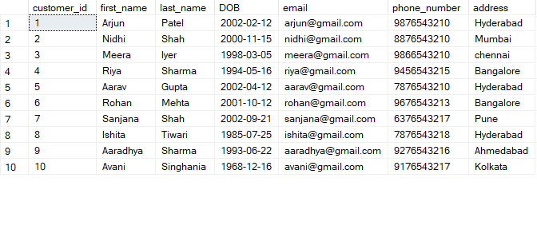
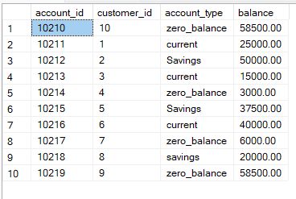
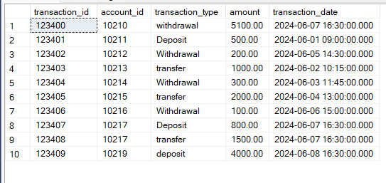
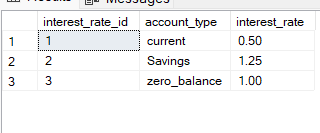
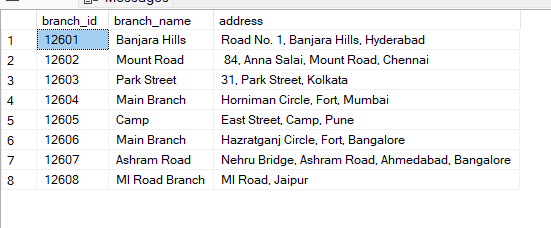

## SQL Assessment

**Database Tables:**

1. **Customers:**

```sql
CREATE TABLE Customers(
customer_id INT PRIMARY KEY,
first_name VARCHAR(50) NOT NULL,
last_name VARCHAR(50) ,
DOB DATE ,
email NVARCHAR(200) UNIQUE,
phone_number VARCHAR(50) UNIQUE,
address VARCHAR(100)
);
```

2. **Accounts:**

```sql
CREATE TABLE Accounts(
account_id INT PRIMARY KEY,
customer_id INT,
account_type VARCHAR(15),
balance DECIMAL(10, 2),
FOREIGN KEY (customer_id) REFERENCES Customers(customer_id)
);
```

3. **Transactions:**

```Sql
CREATE TABLE Transactions(
transaction_id VARCHAR(20) PRIMARY KEY ,
account_id INT ,
transaction_type VARCHAR(15),
amount DECIMAL(10, 2),
transaction_date DATETIME
FOREIGN KEY (account_id) REFERENCES Accounts(account_id)
);
```

4. **InterestRates:**

```sql
CREATE TABLE InterestRates(
interest_rate_id INT PRIMARY KEY ,
account_type VARCHAR(15) ,
interest_rate DECIMAL(5,2),
);

```

5. **Branches:**

```sql
CREATE TABLE Branches(
branch_id INT PRIMARY KEY ,
branch_name VARCHAR(15) ,
address VARCHAR(150),
);
```

**Questions:**

1. Insert at least 10 sample records into each of the following tables: `Customers`, `Accounts`, `Transactions`, `InterestRates`, `Branches`.

```sql
INSERT INTO Customers
VALUES(1,'Arjun','Patel','2002-02-12','arjun@gmail.com',9876543210,'Hyderabad'),
      (2,'Nidhi','Shah','2000-11-15','nidhi@gmail.com',8876543210,'Mumbai'),
	  (3,'Meera','Iyer','1998-03-05','meera@gmail.com',9866543210,'chennai'),
	  (4,'Riya','Sharma','1994-05-16','riya@gmail.com',9456543215,'Bangalore'),
	  (5,'Aarav','Gupta','2002-04-12','aarav@gmail.com',7876543210,'Hyderabad'),
	  (6,'Rohan','Mehta','2001-10-12','rohan@gmail.com',9676543213,'Bangalore'),
	  (7,'Sanjana','Shah','2002-09-21','sanjana@gmail.com',6376543217,'Pune'),
	  (8,'Ishita','Tiwari','1985-07-25','ishita@gmail.com',7876543218,'Hyderabad'),
	  (9,'Aaradhya','Sharma','1993-06-22','aaradhya@gmail.com',9276543216,'Ahmedabad'),
	  (10,'Avani','Singhania','1968-12-16','avani@gmail.com',9176543217,'Kolkata');
```

```sql

SELECT * FROM Customers;

```



```sql
INSERT INTO Accounts
VALUES (10211, 1, 'current', 25000.00),
       (10212, 2, 'Savings', 50000.00),
       (10213, 3, 'current', 15000.00),
       (10214, 4, 'zero_balance', 3000.00),
       (10215, 5, 'Savings', 37500.00),
       (10216, 6, 'current', 40000.00),
       (10217, 7, 'zero_balance', 6000.00),
       (10218, 8, 'savings', 20000.00),
       (10219, 9, 'zero_balance', 58500.00),
	   (10210, 10, 'zero_balance', 58500.00);

```

```sql

SELECT * FROM Accounts;

```



```sql

INSERT INTO Transactions
VALUES (123401,10211, 'Deposit', 500.00, '2024-06-01 09:00:00'),
       (123402,10212, 'Withdrawal', 200.00, '2024-06-05 14:30:00'),
       (123403,10213, 'transfer', 1000.00, '2024-06-02 10:15:00'),
       (123404,10214, 'Withdrawal', 300.00, '2024-06-03 11:45:00'),
       (123405,10215, 'transfer', 2000.00, '2024-06-04 13:00:00'),
       (123406,10216, 'Withdrawal', 100.00, '2024-06-06 15:00:00'),
       (123407,10217, 'Deposit', 800.00, '2024-06-07 16:30:00'),
	   (123408,10217, 'transfer',1500.00,'2024-06-07 16:30:00'),
	   (123409,10219, 'deposit',4000.00,'2024-06-08 17:30:00'),
	   (123400,10210,  'withdrawal',5100.00,'2024-06-07 16:30:00');

```

```sql

SELECT * FROM Transactions;

```



```sql
INSERT INTO InterestRates
VALUES
(1, 'current', 0.50),
(2, 'Savings', 1.25),
(3, 'zero_balance', 1.00);

```

```sql

SELECT * FROM InterestRates;

```



```sql

INSERT INTO Branches
VALUES (12601, 'Banjara Hills', 'Road No. 1, Banjara Hills, Hyderabad'),
       (12602, 'Mount Road', ' 84, Anna Salai, Mount Road, Chennai'),
       (12603, 'Park Street', '31, Park Street, Kolkata'),
       (12604, 'Main Branch', 'Horniman Circle, Fort, Mumbai'),
       (12605, 'Camp ', 'East Street, Camp, Pune'),
       (12606, 'Main Branch', 'Hazratganj Circle, Fort, Bangalore'),
       (12607, 'Ashram Road', 'Nehru Bridge, Ashram Road, Ahmedabad, Bangalore'),
       (12608, 'MI Road Branch ', 'MI Road, Jaipur');
```

```sql

SELECT * FROM Branches;

```


